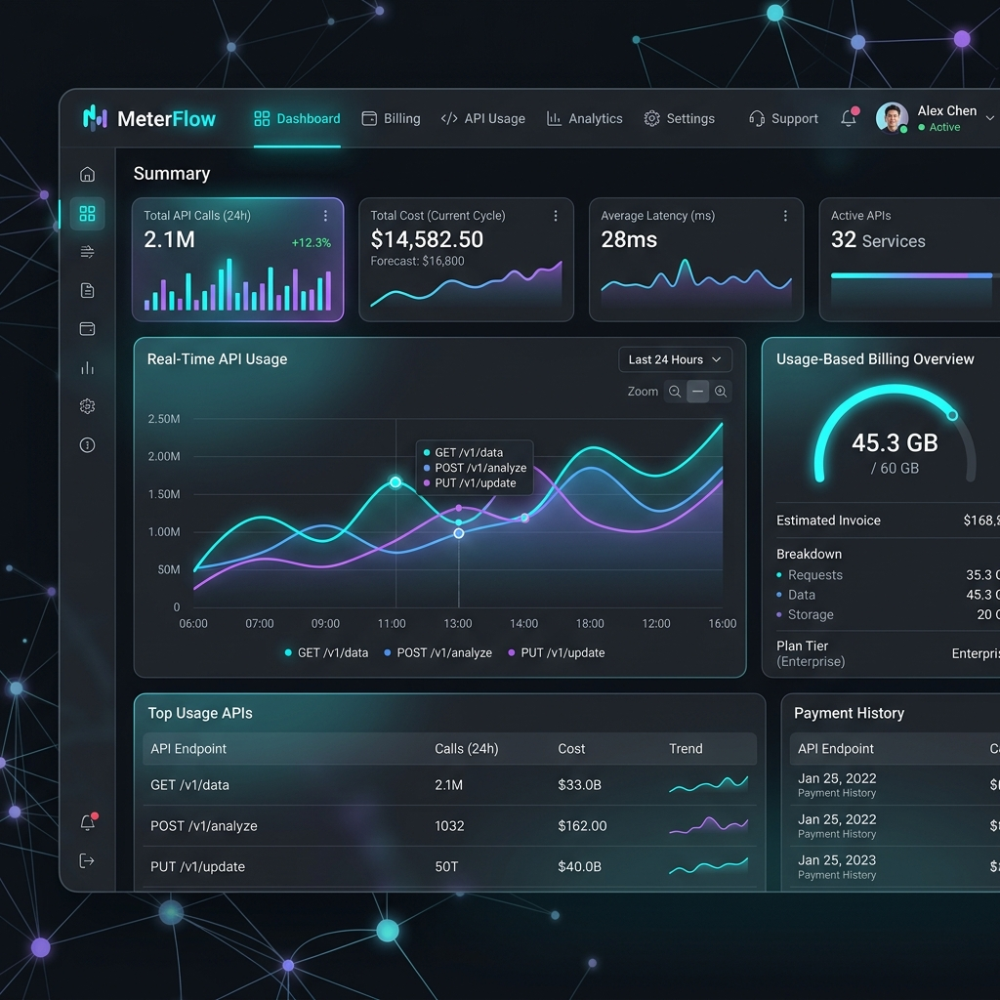
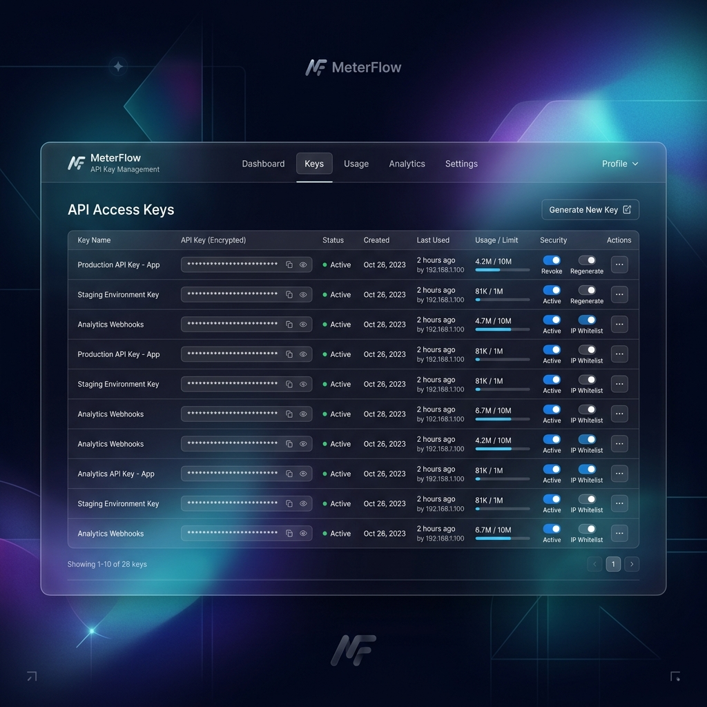
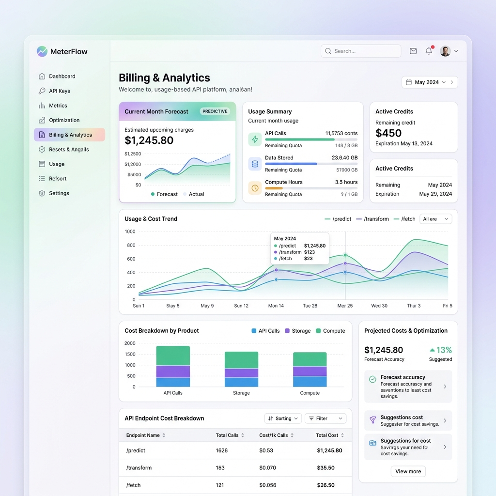

# 🌌 MeterFlow | Premium API Billing & Observability Platform



**MeterFlow** is a high-fidelity, usage-based billing platform designed for modern AI and SaaS infrastructure. It provides seamless integration for API metering, key management, and real-time financial observability with a stunning "Neural" glassmorphism aesthetic.

---

## ✨ Key Features

### 🔐 Advanced Key Management
Implement secure, encrypted API key provisioning with granular permissions and automated rotation.


### 📊 Real-time Usage Observability
Track every request with millisecond precision. Visualize usage patterns through high-performance interactive charts.

### 💳 Usage-Based Billing Engine
Dynamic pricing models including tiered usage, prepaid credits, and pay-as-you-go billing, all managed through a refined "Aurora" light theme.


### 🚀 Neural Dashboard
A state-of-the-art administrative interface featuring:
- **Glassmorphism Design System**: Ultra-modern UI with translucent elements.
- **Neural Network Backgrounds**: Dynamic, AI-inspired visual effects.
- **Micro-interactions**: Fluid transitions and hover states for a premium feel.

---

## 🛠️ Technical Architecture

### **Backend (FastAPI)**
- **Framework**: High-performance FastAPI with asynchronous handlers.
- **Security**: Robust JWT-based authentication and scoped API key validation.
- **Database**: SQLite with optimized schema for high-concurrency event logging.
- **Middleware**: Custom billing middleware for transparent request metering.

### **Frontend (React + Vite)**
- **Foundation**: React 18+ with Vite for ultra-fast HMR.
- **Styling**: Pure Vanilla CSS for maximum flexibility and performance.
- **State Management**: Context API for global application state.
- **Visuals**: Lucide Icons and custom-crafted CSS animations.

---

## 🏁 Getting Started

### **Prerequisites**
- Python 3.9+
- Node.js 18+
- npm or yarn

### **Backend Setup**
1. Navigate to the backend directory:
   ```bash
   cd backend
   ```
2. Create and activate a virtual environment:
   ```bash
   python -m venv venv
   source venv/bin/activate  # Windows: venv\Scripts\activate
   ```
3. Install dependencies:
   ```bash
   pip install -r requirements.txt
   ```
4. Initialize the database:
   ```bash
   python init_db.py
   python seed.py
   ```
5. Run the server:
   ```bash
   python run.py
   ```

### **Frontend Setup**
1. Navigate to the frontend directory:
   ```bash
   cd frontend
   ```
2. Install dependencies:
   ```bash
   npm install
   ```
3. Start the development server:
   ```bash
   npm run dev
   ```

---

## 🛡️ License

This project is licensed under the MIT License - see the LICENSE file for details.

---

<p align="center">
  Built with 💜 by <a href="https://github.com/abhiramvsmg">abhiramvsmg</a>
</p>
